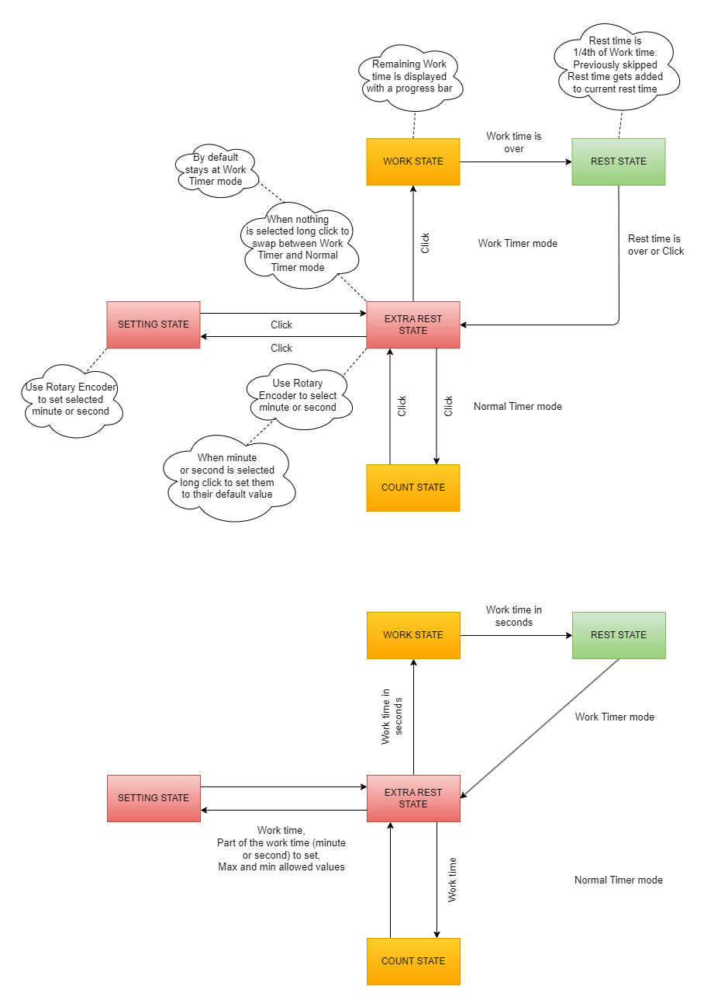

## Simple Timer concept Based on 20 mins work 5 mins rest

***

[Watch Full Demonstration Video](https://youtu.be/4kEsuC3sUa4?si=FrynVV4_hmVubUNK)

***

This is a simple Timer device made with `Arduino Nano`. I made it to help me increase my productivity while getting adequate rest.

It has two modes of operation:

* **Study Timer Mode**
* **Normal Mode**

In **Study Timer Mode** you can set a study time (20 mins usually), and start the timer, after it ends it counts 1/4th of that study time (5 mins usually) as resting time.

In **Normal Mode** it behaves like any other normal timer. Set a time, start count down, pause & resume.

Circuit Diagram:

State Transition Diagram:

